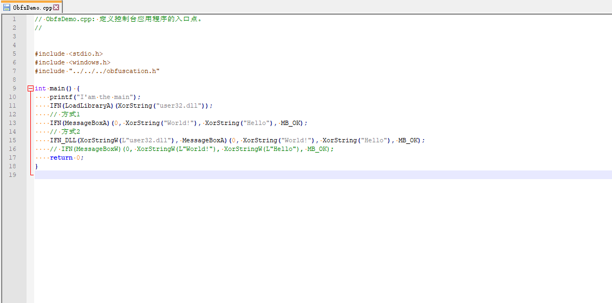

## VisualStudio Obfuscation
Help you hide ALL the string in your program and ALL the api in your program

## Usage

<a href="https://blog.his.cat/a/vs_obfuscation.cat" target="_blank">使用LLVM Obfuscator / constexpr / PEB调用API 进行程序混淆</a>

## Take a look
